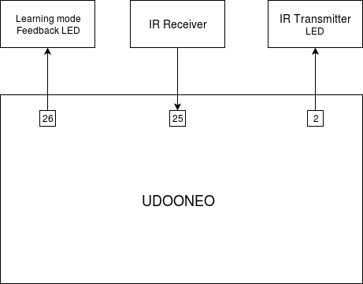
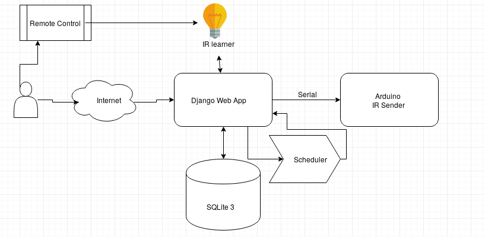

# WillyFog
Server app that runs on a UDOO Neo board. The app helps users easily manage their devices at home, using interaction through infrared waves.

Written for Linux Embedded Challenge 2017.

## About the App

The WillyFog web app is written in Python 2, using Django. For interacting with IR protocols, we use a Python library ([Neo.GPIO](https://github.com/smerkousdavid/Neo.GPIO)) and C++ with Arduino.

## Installation
After being connected to the UDOONeo board, from the cloned repository, try the commands from [here](requirements.txt).

## Usage

Make sure you're inside the virtual environment ("(venv)" is written at the end of your prompt). Then type:
```sh
python manage.py runserver 0.0.0.0:8080
```
The server will run on port 8080. Now all devices logged into the same network will be able to access the web interface at the board's address (board_ip:8080). You can try our [step by step guide](setup_guide.md) for more details.

## Project Structure
### Hardware

The learning mode LED and the IR Receiver are connected to the external pin bank of UDOO NEO, the GPIO
pins. The IR Transmitter is connected to the dedicated internal pin bank for Arduino. 



### Software

The project consists of four modules:

 * a web app
 * a scheduler
 * an infrared code learner
 * an infrared code sender



##### The web app
To interact with the board, a user has to access the WillyFog web app. The app is written in Python 2, using Django. We chose the Django framework because it's easy to use, it's very well documented and it has powerful, easy to use tools for login / logout, HTML syntactic sugars and tools for interacting with databases.

We store our data in a SQLite 3 database. Objects stored into the database:

 * ordinary Users and the Admin (stored by default by Django)
 * Devices - associated to users; each User has one ore more Devices; a device has attributes like "Name", "Author" and multiple Commands; in the future, we might have to add the Protocol attribute, as the IR protocol the device uses
 * Commands - associated to devices; each Device has one ore more learned Commands, each defined by Name, Code (infrared code) and Device;
 * Events - represent user-scheduled events like "turn TV on at 17:00" (once) or "turn A/C on at 10:00 everyday"; each event has a Scheduled Time and an "Everyday" field, apart from a Device and a Command

##### The scheduler
For the scheduler, we used [APScheduler](https://apscheduler.readthedocs.io/en/latest/), a python library that has "at" and "cron" -like functionalities. The web app adds events to the scheduler queue or deletes every time an event is scheduled, respectively when an event is deleted.

Events that are scheduled to only run once are deleted from the database after they are executed (or when a user cancels them).

##### The infrared code learner
This modules uses [Neo.GPIO](https://github.com/smerkousdavid/Neo.GPIO), a python library originally written for Raspberry Pi. The library helps us manage UDOO GPIO, then we analyse the received frequencies to read the received codes.
The user follows instructions received via the web app (e.g. keeps a button pressed untill the web app notifies him it's ready - at most around 5 seconds) untill the learner is done sampling. The learner is meant to receive multiple samples, untill it has enough information to decide the correct code.

We currently implemented learning (and sending) for the SONY infrared protocol. To extend the functionality, we will later decide the used protocol by analysing the IR signal's headers.

We used the code example for NEC protocol from [here](https://blog.bschwind.com/2016/05/29/sending-infrared-commands-from-a-raspberry-pi-without-lirc/).

##### The infrared code sender
Since signal sending has to be very exact (we need very well-timed delays), it cannot be done on the Cortex-A9 core (since timing is affected by the scheduler), so it must be done on the Arduino core (Cortex-M4). This way, sending is executed real-time. We implemented sending for the SONY protocol, using the example for NEC from [here](https://gist.github.com/EEVblog/6206934).

When the user triggers a command (or a scheduled event is due), the web app just uploads an Arduino C++ script on the M4 core and that's it! The cores communicate via the serial interface.
